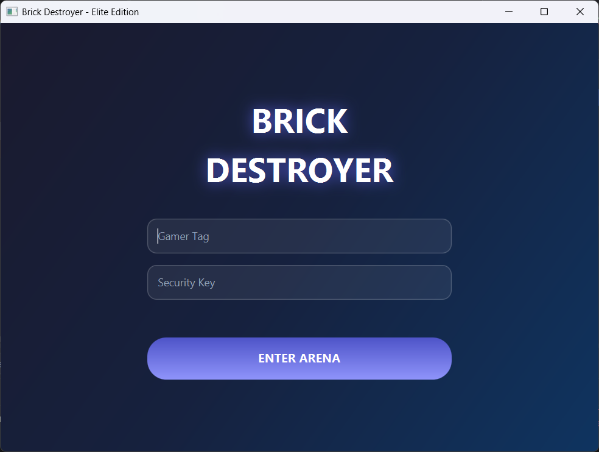
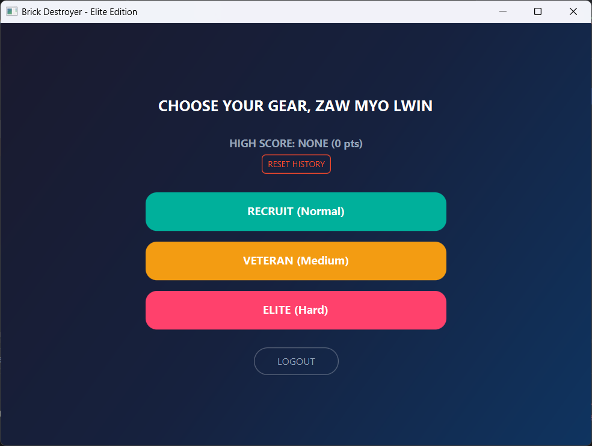
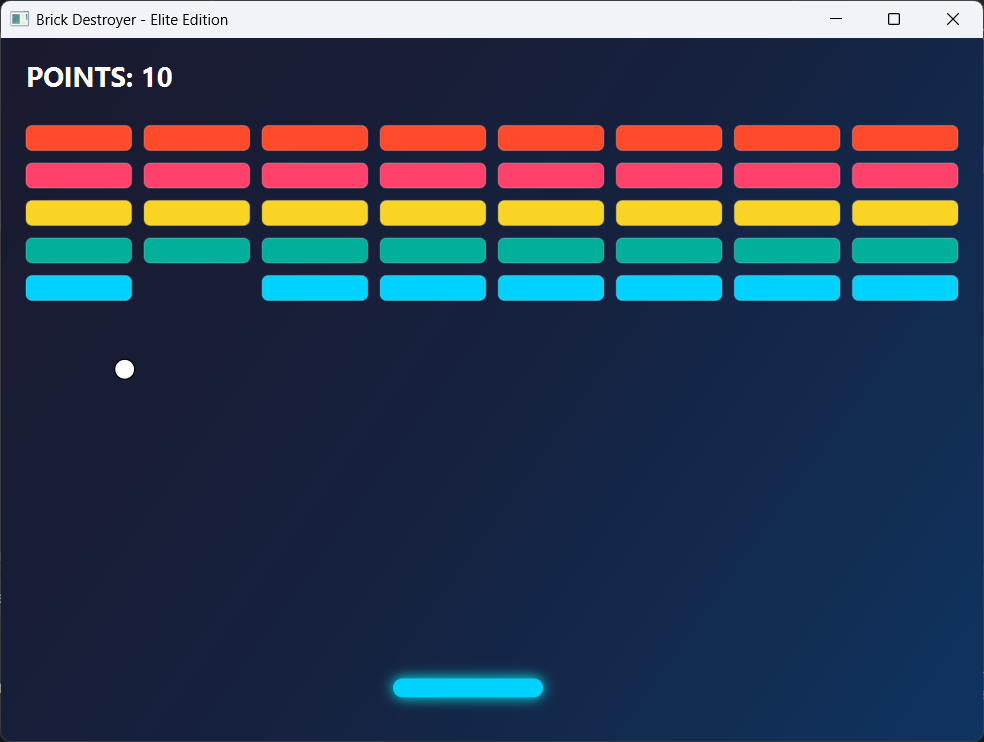

# Brick Destroyer - Elite Edition

A visual, responsive arcade Breakout-style game designed and implemented using JavaFX. This application was built as a Computer Engineering visa project submission.

---

## 🚀 Key Features

* **Authentication (10 Points):** Secure local authentication system validating unique Gamer Tags and Security Keys against a local `users.txt` database. New users are registered automatically on the fly.
* **File Processing (10 Points):** Persistent local drive high-score tracking via `highscore.txt`. Keeps record of the top score and the elite gamer tag who holds it.
* **Core Core Mechanics (50 Points):** * Responsive GUI layout that dynamically recalculates brick grids and boundary limits during window resizing.
    * Multi-ball deployment mechanism: spawns secondary ball dynamics every time a 100-point threshold is unlocked.
    * Three selectable game speeds: Recruit (Normal), Veteran (Medium), and Elite (Hard).

---

## 📸 Application Interface Previews

### 1. Login Arena & Security Gates

*Local user database validation window with customized dark gradient theme styles.*

### 2. Gear & Speed Selection Lobby

*Profile dashboard featuring dynamic player tag retrieval and persistent global high scores.*

### 3. Core Gameplay Arena

*Active game panel demonstrating drop shadows, adaptive brick distribution, and boundary collision checks.*

---

## 💻 Installation & Running Procedure

Follow these steps to install and run the application locally from your terminal.

### Prerequisites
* **Java Development Kit (JDK):** Version 17 or higher.
* **Apache Maven:** Installed and configured in your system environment path.

### Step 1: Clone the Repository
Open your terminal or command prompt and clone this project:
```bash
git clone https://github.com/ZawMyoLwinOffical/BrickDestroyer.git